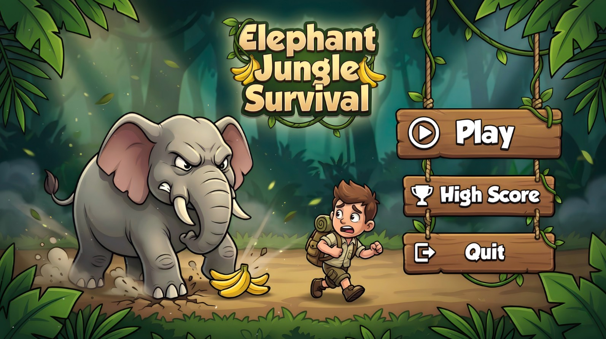
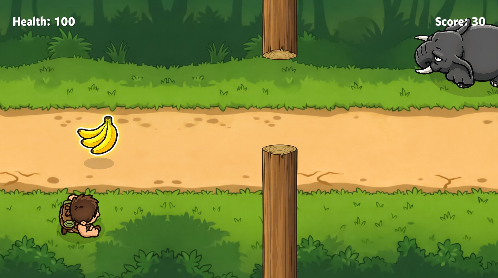
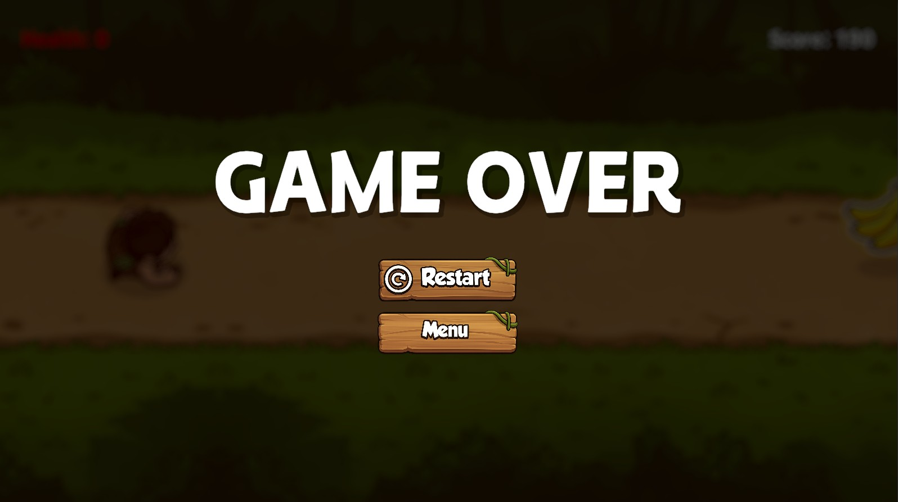
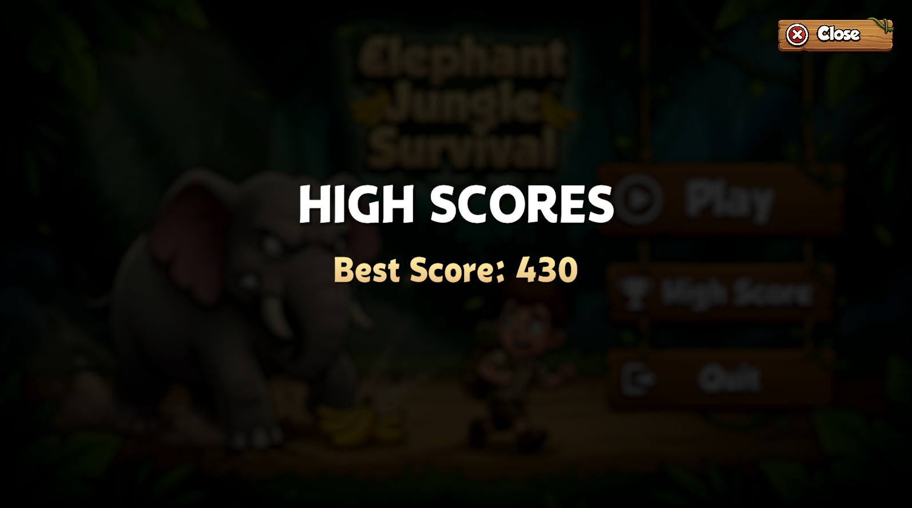

# Assignment 02 (Individual) – GAMES DEVELOPMENT

**SE4031 – Games Development**  
**Title – 2D Interactive Game**  
**Assignment Created By:** Mr. Aruna Ishara Gamage, Mr. Nushkan Nismi  
**Weight:** 20%

---

# 🐘 Elephant Jungle Survival

A 2D jungle survival game developed using **Unity** as part of the **SE4031 – Games Development** module.

## 🎮 Game Overview

**Elephant Jungle Survival** is a fast-paced 2D survival game where the player controls an elephant navigating through a dangerous jungle environment.  

The objective is to:
- Avoid obstacles  
- Defeat enemies using projectiles  
- Collect health packs  
- Survive as long as possible while increasing score  

As the game progresses, difficulty increases with speed, making the gameplay more challenging and engaging.

---

## 🚀 Features

- ❤️ **Health System**
  - Health bar displayed on UI  
  - Decreases on collisions  
  - Restores using health packs  

- 🧮 **Score System**
  - Score increases during gameplay  
  - Resets on restart  

- 🎯 **Projectile System**
  - Shoot using mouse click  
  - Destroy enemies and objects  

- 👾 **Enemies**
  - Damage the player  
  - Destroyable using projectiles  
  - Increase score when defeated  

- 🎁 **Health Packs**
  - Restore player health  
  - Spawn dynamically  

- ⚡ **Dynamic Difficulty**
  - Player speed increases over time  

---

## 🕹️ Controls

| Action | Input |
|------|------|
| Move Player | W / A / S / D or Arrow Keys |
| Shoot | Left Mouse Click |
| Menu | Mouse |

---

## 📸 Screenshots

---

## 🎥 Demo Video

👉 Watch Gameplay Demo:  
[Gameplay Demo Video.mp4](https://mysliit-my.sharepoint.com/:v:/g/personal/it22581570_my_sliit_lk/IQDPgEQm70TmT4j2I0ierBlLAaUhOePYCZrbD0CfTuVbgbs?nav=eyJyZWZlcnJhbEluZm8iOnsicmVmZXJyYWxBcHAiOiJPbmVEcml2ZUZvckJ1c2luZXNzIiwicmVmZXJyYWxBcHBQbGF0Zm9ybSI6IldlYiIsInJlZmVycmFsTW9kZSI6InZpZXciLCJyZWZlcnJhbFZpZXciOiJNeUZpbGVzTGlua0NvcHkifX0&e=Nn6yM5)

## 📁 Project Download (OneDrive)

👉 Download Full Project:  
[Assignment 02 - 2D Interactive Game](https://mysliit-my.sharepoint.com/:f:/g/personal/it22581570_my_sliit_lk/IgAqwd4C2nqxR7Bw9wmT2DepAZOpmDXG7kUM8PB2g2FUDBo?e=RjSCaV)

---

## 🛠️ Built With

- Unity (2D Game Engine)  
- C#  
- Visual Studio  

---

## 🎨 Assets & Credits

- Sound Effects: Pixabay  
- Game Assets: Generated using ChatGPT & Nano Banana  
- Development Tool: Unity Engine  

---

## 👤 Author

- Name: Jayalath K.M.K.D
- IT Number: IT22581570